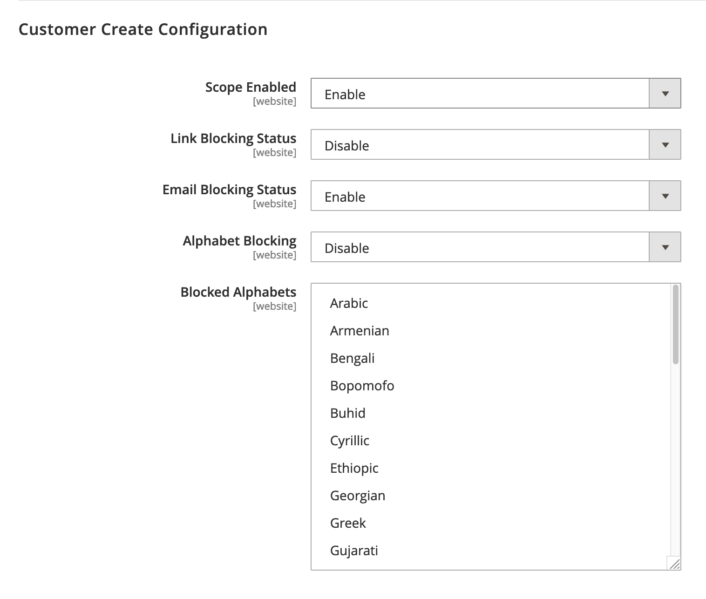
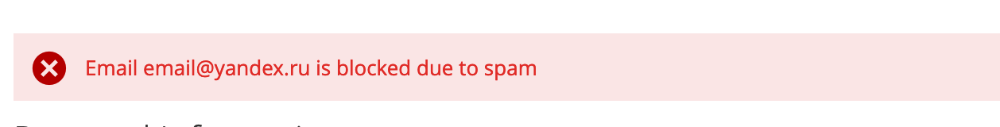

# Magento 2 Spam Filter Module
This Magento 2 module seeks to help store owners tackle the frustration 
of dealing spam users created by bots and/or foreign spam factories.

The goal of this module is to block user input to the store by filtering content based on
1. Character sets e.g Cyrillic and Han
2. Wildcard matching email addresses
3. Web url detection in text

## Features

### Scoped configuration

As this module provides filtering feature for many entry points.
It's for me that this module fits you. That is why this module allows you
to toggle the settings based on scope. No need to filter newsletter signups
if you just want to filter customer creation.

### Character detection

Are you contact form entries or maybe customer registrations from Russia?
Sounds like you need to to block the cyrillic character. With this module
you can do such thing.

### Email matching

Tired of spam customers with `@qq.com` or `@yandex.ru`?
With many years of experience this module will provide you with a prefilled list of popular spam domains that you can block with a click of a button.
You can add and remove any domains and wildcard matching as you see fit.

### Web url detection

A close to perfect way of blocking spam bots throwing in advertisement urls in first- and lastname on customer registration for 

## Compability

Compability tested with Magento 2.3.x on PHP 7.2
Compability with 2.2.x and PHP > 7.2 is not guaranteed but may work
