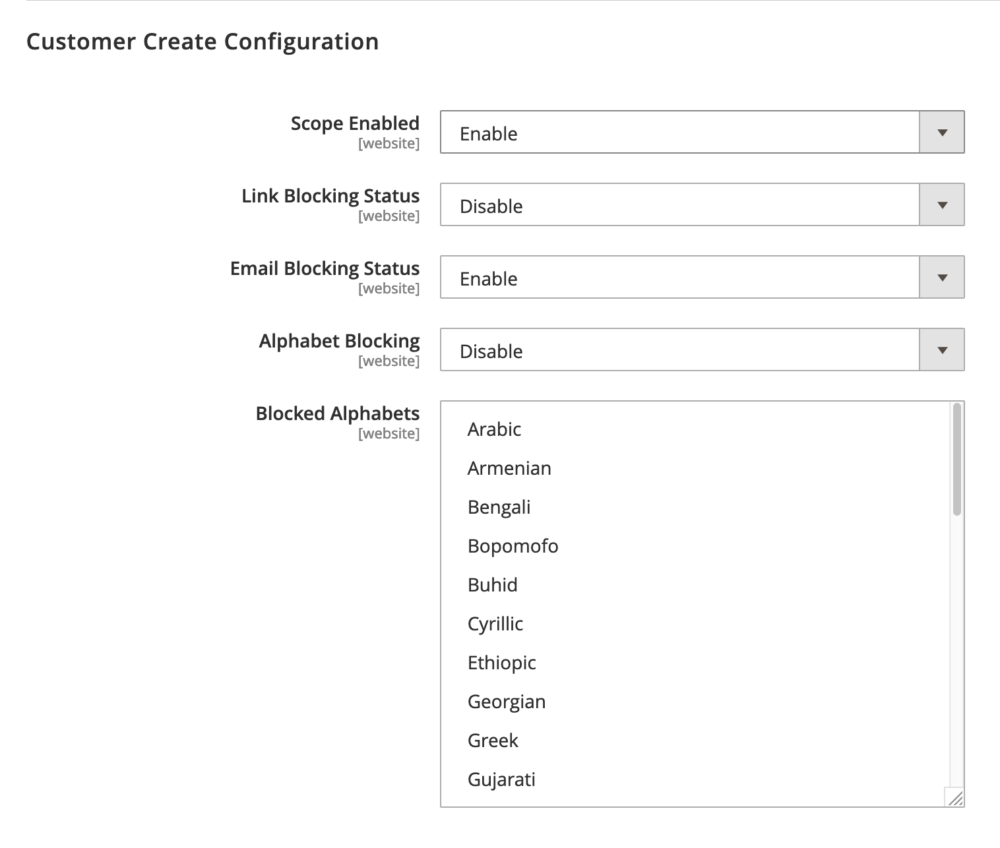

# SpamFilter

A plug and play ready module for magento 2 that helps store owners tackle the frustration 
of dealing spam users created by bots and/or foreign spam factories.

## Installation

Use the package manager [composer](https://getcomposer.org/) to install.

```bash
composer install prooxxy/magento2-spamfilter
```

Make sure the module is enable before start using

```bash
php bin/magento module:enable PrOOxxy_SpamFilter
```

### Alternative installation

Download the [Latest release](https://github.com/Pr00xxy/magento2-dotenv/archive/0.2.0.zip)

## Features

This module provides blocking for three areas in your installation
1. Customer registration
2. Newsletter signup
3. Contact Form

All three areas can be configured independently to have custom rules for what can be inputted.



### Alphabet blocking

Block entries based on a list of languages.
e.g block Cyrillic or Hanzi characters

### Link blocking

Block contact form entries from containing links
Block customers from putting links in their firstname or lastname

### Email Blocking

Block newsletter signup, customer registration or contact form entries from specific domains


## Compability

Compability tested with Magento 2.3.x on PHP 7.3
Compability with 2.2.x and PHP < 7.2 is not guaranteed but may work  

## License
[MIT](https://choosealicense.com/licenses/mit/)
